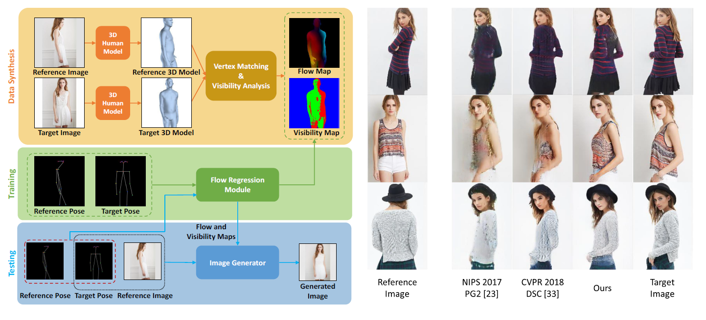

# Dense Intrinsic Appearance Flow for Human Pose Transfer

This is a pytorch implementation of the CVPR 2019 paper [Dense Intrinsic Appearance Flow for Human Pose Transfer](http://mmlab.ie.cuhk.edu.hk/projects/pose-transfer/).



## Requirements
- python 2.7
- pytorch (0.4.0)
- numpy
- opencv
- scikit-image
- tqdm
- imageio

Install dependencies:
```
pip install -r requirements.txt
```

## Resources

### Datasets
Download and unzip preprocessed datasets with the following scripts:
```
bash scripts/download_deepfashion.sh
bash scripts/download_market1501.sh
```
Or manually download them from the following links:
- DeepFashion (23GB): [Google Drive](https://drive.google.com/file/d/1LbibHhhF7xA7G3hHoHj9I-MvCByzdkvr/view?usp=sharing)
- Market-1501 (9GB): [Google Drive](https://drive.google.com/file/d/16zZJ5f5qOJcgg-cPfmAdso8al-MSWiwu/view?usp=sharing)

### Pretrained Models
Download pretrained models with the following scripts:
```
bash scripts/download_models.sh
```
These models include:

| Deepfashion | Market-1501 | Others |
|-------------|-------------|--------|
|-`PoseTransfer_0.1` (w/o. dual encoder)<br>-`PoseTransfer_0.2` (w/o. flow)<br>`PoseTransfer_0.3` (w/o. vis)<br>`PoseTransfer_0.4` (w/o. pxiel warping)<br>`PoseTransfer_0.5` (full)|`PoseTransfer_m0.1` (w/o. dual encoder)<br>`PoseTransfer_m0.2` (w/o. flow)<br>`PoseTransfer_m0.3` (w/o. vis)<br>`PoseTransfer_m0.4` (w/o. pxiel warping)<br>`PoseTransfer_m0.5` (full)|`Fasion_Inception`(for computing FashionIS)<br>`Fasion_Inception`(for computing AttrRec-k)|

## Testing
### DeepFashion
1. Run scripts/test_pose_transfer.py to generate images and compute SSIM score.
```
python scripts/test_pose_transfer.py --gpu_ids 0 --id 0.5 --which_epoch best --save_output
```
2. Compute inception score with the following script:
```
# python scripts/inception_score.py image_dir gpu_ids
python scripts/inception_score.py checkpoints/PoseTransfer_0.5/output/ 0
```
3. Compute fashionIS and AttrRec-k with the following scripts:
```
# FashionIS
python scripts/fashion_inception_score.py --test_dir checkpoints/PoseTransfer_0.5/output/
# AttrRec-k
python scripts/fashion_attribute_score.py --test_dir checkpoints/PoseTransfer_0.5/output/
```
### Market-1501

## Training
Coming soon.

## Citation
```
@inproceedings{li2019dense,
  author = {Li, Yining and Huang, Chen and Loy, Chen Change},
  title = {Dense Intrinsic Appearance Flow for Human Pose Transfer},
  booktitle = {IEEE Conference on Computer Vision and Pattern Recognition},
  year = {2019}}
```


